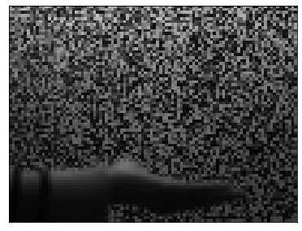
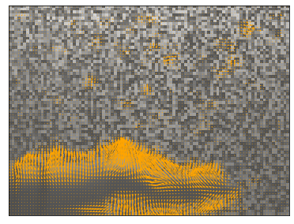
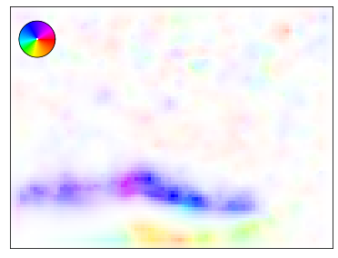
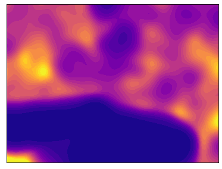

Python implementation of [Refraction Wiggles for Measuring Fluid Depth and Velocity from Video
](http://people.csail.mit.edu/tfxue/proj/fluidflow/)

Python >= 3.6 is required

## Example case

* Install Python dependencies under repository's root directory:

```pip install -r requirements.txt```

* Download example video file:

```wget http://people.csail.mit.edu/tfxue/proj/fluidflow/download/data.zip && mkdir -p data && unzip -p data.zip data/hand.avi > data/hand.avi && rm data.zip```

* Run example case:

```python example_hand.py```

* Example results (an example frame, the corresponding flow  field visualized in two ways, and the variance of the estimated flow):

 


